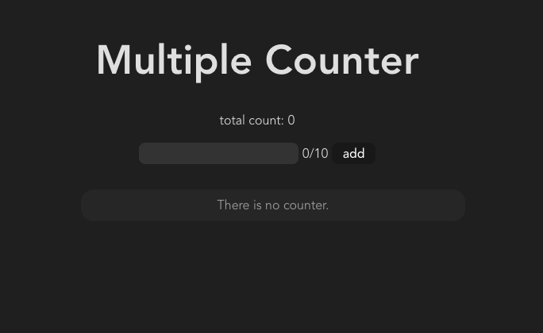

# 説明
複数のカウンターを設定できるアプリ

# 機能一覧

## 基本機能
- カウントのプラス、マイナス、リセット
- カウンター自体の追加、削除
- カウンターのタイトル変更
- カウンターの合計値を表示

## 追加機能

- カウンターの数値
    - 桁数が変わっても横幅は不変
    - 値の範囲(0~10000)
- 文字数のバリデーション
    - 初期名入力欄
        - 文字数の表示、制限超えたら赤文字に変化
    - 名前変更欄
        - バリデーションエラーは一瞬赤く光ってお知らせ
            - 変更してEnter押されたとき
            - フォーカスが外れたとき

